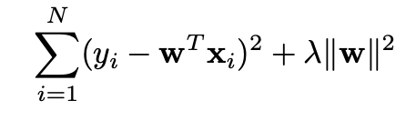
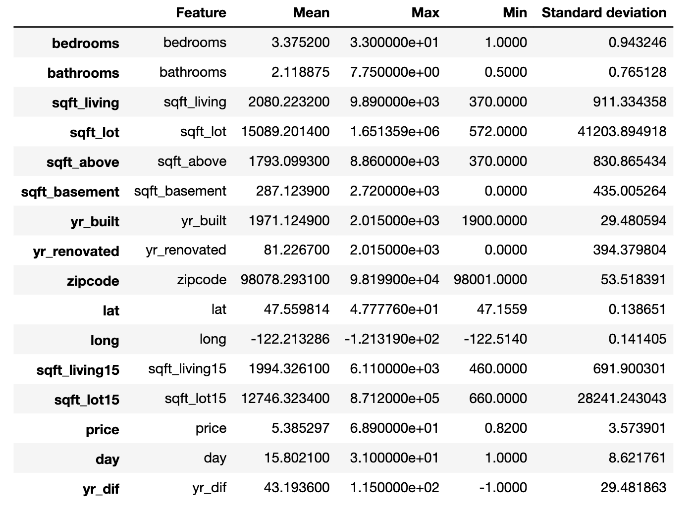
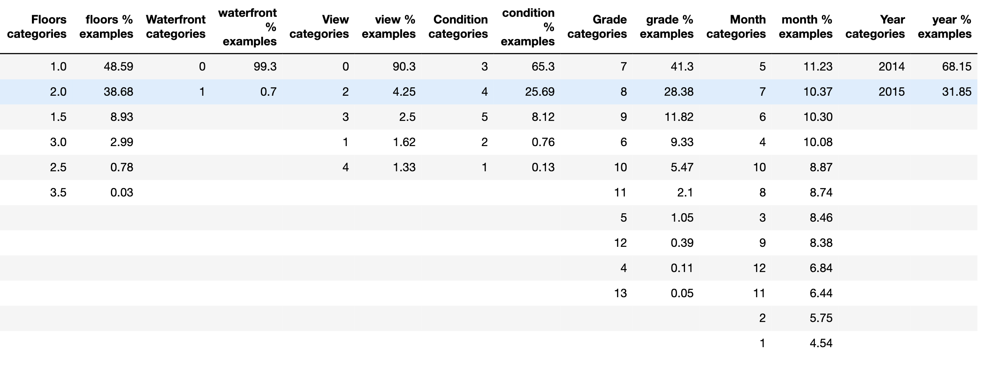
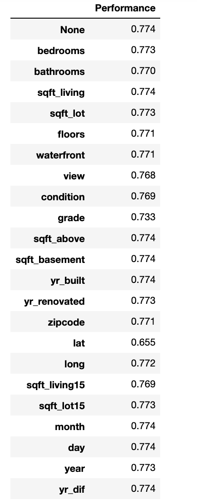
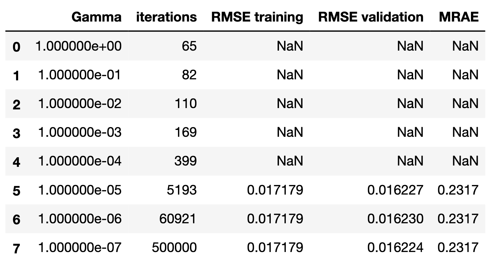
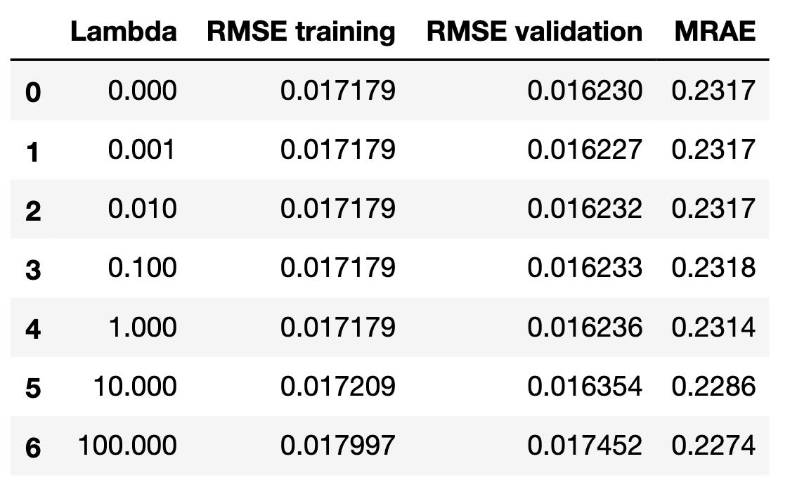
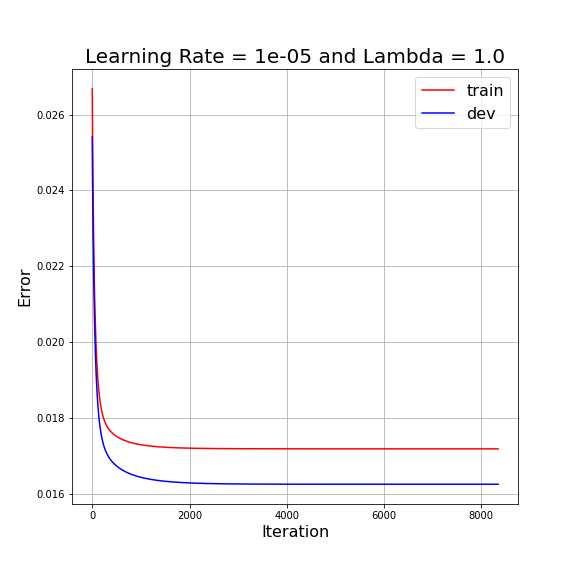
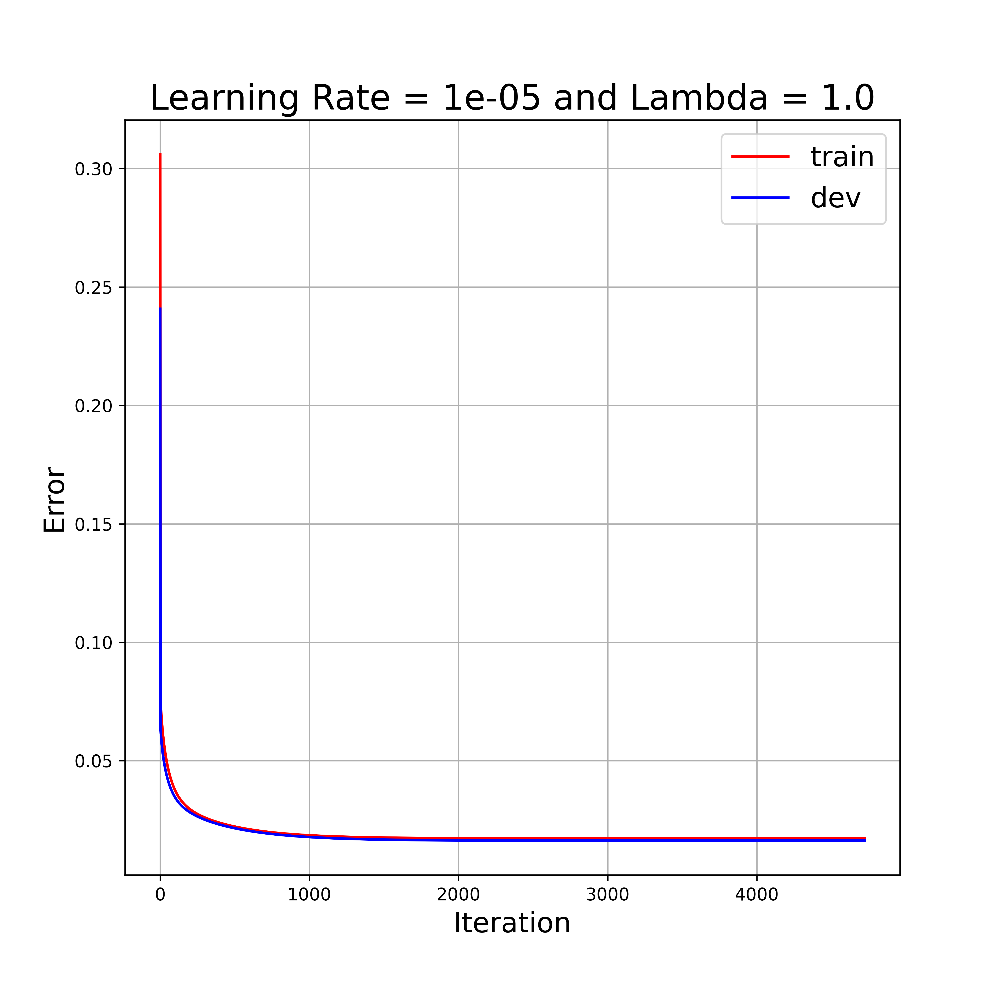

# House-Price-Prediction

## Content

 - [Objective](#obj)
 - [Data](#data)
 - [1: Data Preprocessing](#Part-0)
 - [2: Impact of different Learning Rate](#Part-1)
 - [3: Impact of Regularization hyperparameter](#Part-2)
 - [4: Impact of Normalization](#Part-3)
 - [Conclusion](#Conclusion)
---

 <a name="obj"><b style="font-size:20px"> 
Objective</b> </a> 

- To build a linear regression with L2 regularization that can be used to predict 
the house’s price based on a set of features.
- Develope insight on impact of Learning Rate, Regularization hyper-parameter 
  and normalization on model performance.

 <a name="reggression"><b style="font-size:20px"> 
Linear Regression with L2 Regularization</b> </a> 

__Linear Regression:__ It is fitting of a straight line to data i.e. 
linear mapping of input features to output values.

__L2 Regularization:__ It is also known as Ridge regression. It adds 
"sum of square of all weights" to cost function as a penalty term.
The L2 penalty is tunned by a hyperparameter \lambda . 

The loss function of linear regression with L2-regularization is given below:

Here __w__ are weights of features and \lambda is regularization parameter
to penalty term.

 <a name="data"><b style="font-size:20px"> Data</b> </a> 

The dataset consisted of historic data on houses sold between May 2014 to 
May 2015.There are two data files:  <b>training (10000 examples) and devlopment (5597 examples)</b> 

The dataset consisted of 23 features (including the dummy). 
The last one is the target for prediction. Variables Description Data Type
1. dummy [numeric]: 1
2. id [numeric]: a notation for a house 
3. date [string]: Date house was sold. __Splits into 3 categories: day of month,year, month__
4. bedrooms[numeric]: Number of Bedrooms/House
5. bathrooms[numeric]: Number of bathrooms/bedrooms 
6. sqft_living [numeric]: square footage of the home
7. sqft_lot [numeric]: square footage of the lot
8. floors [numeric]: Total floors (levels) in house
9. waterfront [numeric, Categorical]: House which has a view to a waterfront 
10. view [numeric]: Has been viewed 
11. condition [numeric, Categorical]: Overall condition 1 indicates worn out property and 5 excellent 
12. grade [numeric, Categorical]: Overall grade given to the housing unit. 1 poor ,13 excellent
13. sqft_above [numeric]: square footage of house apart from basement 
14. sqft_basement [numeric]: square footage of the basement 
15. yr_built [numeric] : Built Year
16. yr_renovated [numeric]: Year when house was renovated (0 if n/a)
17. zipcode [numeric]: zip 
18. lat Latitude [numeric] : coordinate 
19. long Longitude [numeric]: coordinate 
20. sqft_living15 [numeric]: Living room area in 2015 
21. sqft_lot15 [numeric]: lotSize area in 2015
22. price [numeric, continuous] : Price/100k, which is the __prediction target__

 <a name="part-0"><b style="font-size:20px">
Data Preprocessing</b> </a> 

Following objectives were accomplished in preprocessing

__1. Checked for  Missing values :__ No missing values in the data

__2. Data Statistics :__ Features were classified in two categories: Numerical and Catergorical

For Numerical Features:  

For Category Features:  

__3. Remove Outliers :__ For numerical features, examples below 0.01 quantile and higher 0.99 quantiles 
are dropped. Near 90 outlie examples are dropped.

__4. Feature Selection :__ Features were selected based on 3 methods:

__4.1__ Graphical analysis: 
__scatter plot__(predictor versus response)

__histogram__

__4.2__ Abalation Analysis : Features were dropped one by one and ridge regression 
model accuracy is measured. If drop of a feature causes significant decrease in accuracy,
then it implies the feature has high importance.

__4.3__ Correlation Matrix : A multicolinearity was tested using correlation matrix.

Based on feature selection analysis dropped these features :  

sqft_living , sqft_lot15, yr_dif, year

and saved the filtered data.

 <a name="part-1"><b style="font-size:20px"> 
Part 1: Impact of different Learning Rate</b> </a> 

Explored different learning rates for batch gradient descent. Following learning rates 
are tested:[1e-0,1e-1,1e-2,1e-3,1e-4,1e-5,1e-6,1e-7]

here gamma is learning rate. Based on results,  1e-5 is picked as optimum learning rate.

 <a name="part-2"><b style="font-size:20px"> 
Part 2: Impact of Regularization hyper-parameter </b> </a> 

Explored different learning rates for batch gradient descent. Following learning rates 
are tested:[0,1e-3,1e-2,1e-1,1,10,100]

here lambda is hyper-parameter to handle L2 regularization term and 1.0 is picked.

 <a name="part-3"><b style="font-size:20px"> 
Part 3: Impact of Normalization</b> </a> 

Training with non-normalized data Use the preprocessed data but skip 
the normalization.

*Without Normalization*

*with Normalization*

 <a name="conclusion"><b style="font-size:20px"> 
Conclusion</b> </a> 

1: Learning rate 1e-5 and Lambda 1.0 are found to be optimum.

2: No significant difference is observed in model's RMSE with and without 
normalization. However, with normalization model learn faster than without 
normalization.

